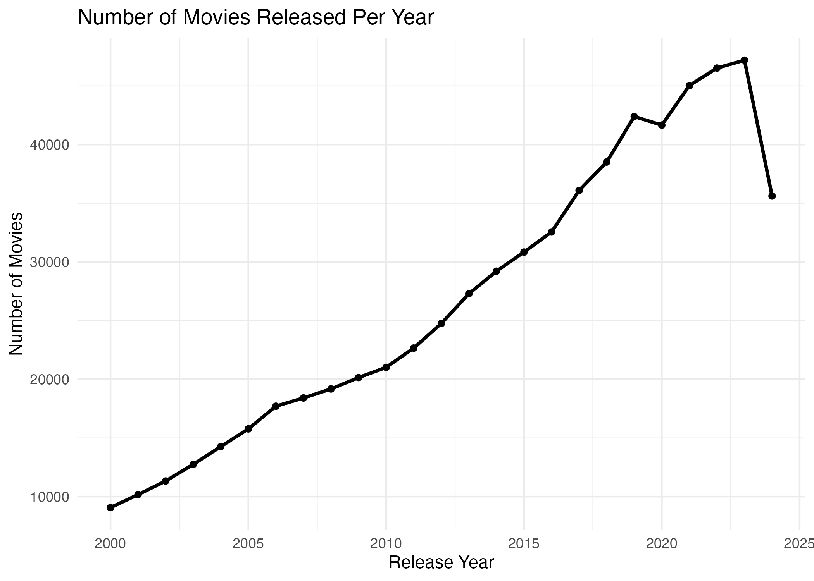
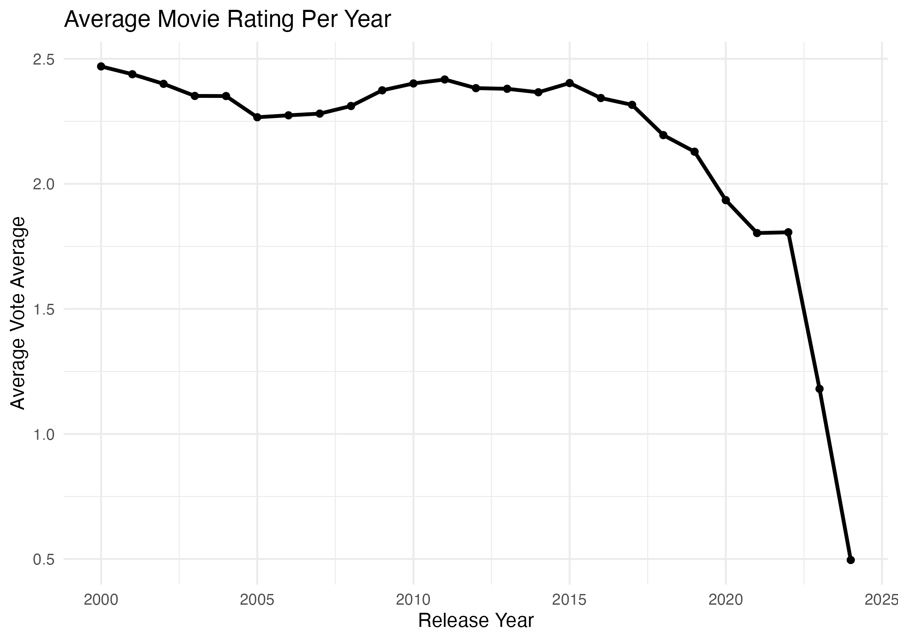
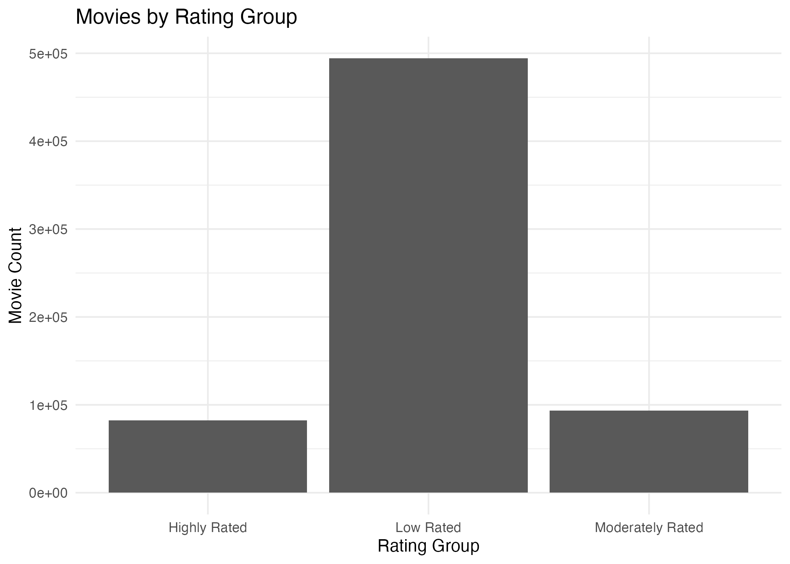
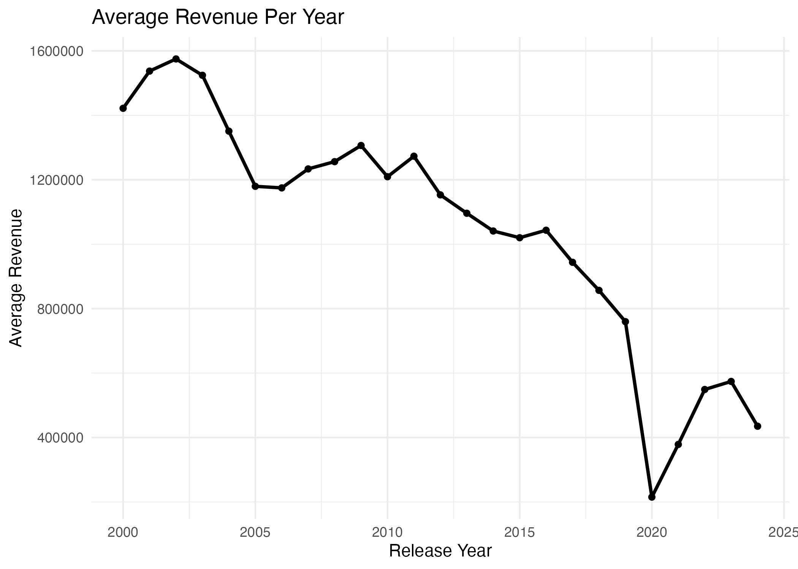
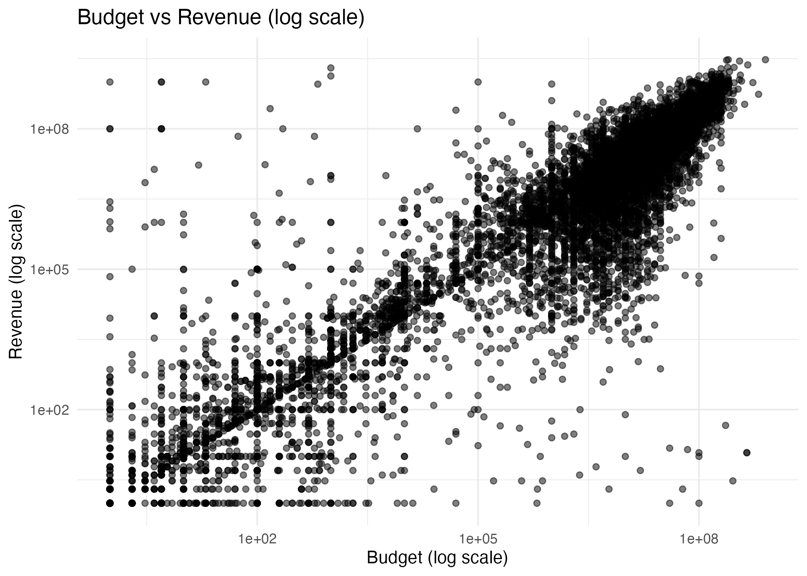
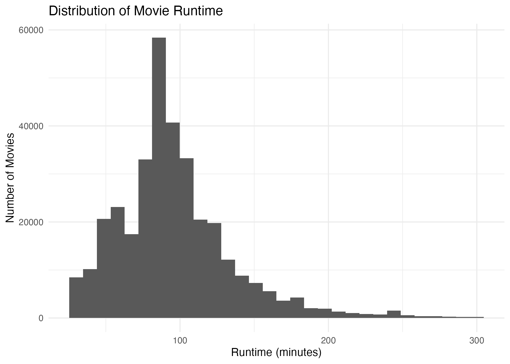
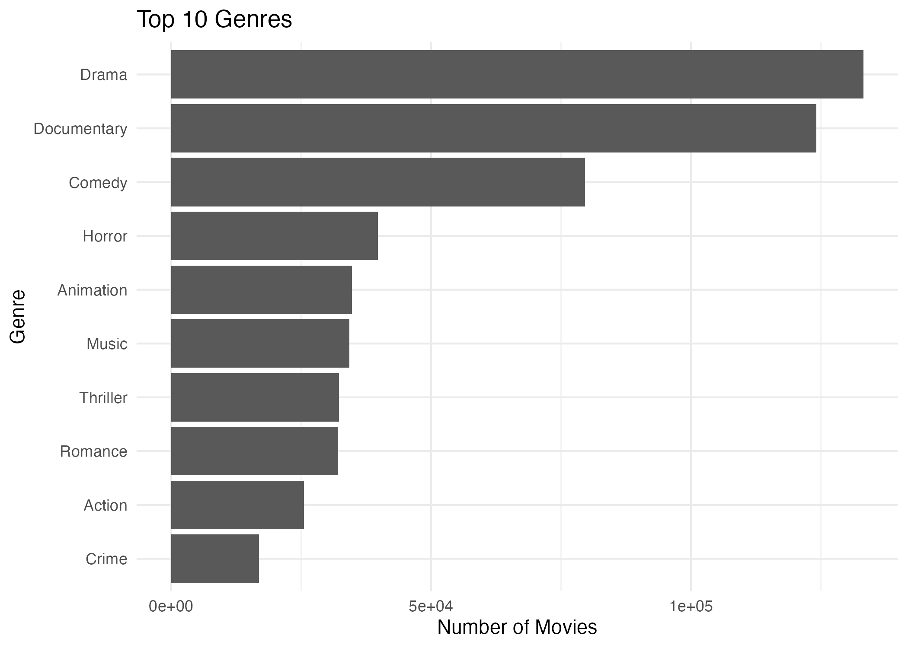

```{r setup, include=FALSE}
setwd("/Users/kalyankankanala/MovieAnalysis")
library(ProjectTemplate)
load.project()
source("src/Analysis_function.R")
source("src/Cycle1_Analysis.R")
source("src/Cycle2_Analysis.R")
source("src/Summary_Analysis.R")
knitr::opts_chunk$set(echo = FALSE, warning = FALSE, message = FALSE)
```

# Introduction
## Context
The film industry contributes a significant amount of revenue globally through cinema sales and streaming platforms. The success of a film depends on multiple factors, which makes it important to identify and analyse the key factors to ensure the continuous profitability of the industry as well as the enhancement of the global economy. In this regard, the current report is concerned with analysing a movie dataset containing data regarding different success factors of movies from 2000 to 2024. The report has utilised the CRISP-DM framework to profoundly analyse data by breaking the process into 2 CRISP-DM cycles. CRISP-DM methodology involves a multi-steped iterative framework for the profound analysis of complex scenarios (Bemthuis et al., 2025). The first cycle has focused on understanding the film industry in terms of exploring the patterns of success, ratings, revenue growth and many more related aspects. The secondary cycle has focused on the in-depth analysis of the influence of genre and language on movie success.

## Research Objectives
First Cycle

To determine the success pattern of movies from 2000 to 2024 by exploring different factors associated with it

To comprehend the connection between a movie's budget and its revenue contribution

To identify the movies associated with high revenue and high ratings, and to comprehend the features most significant for movie success

Second Cycle

To examine the way movie genre impacts the ratings and the commercial success of movies

# First CRISP-DM Cycle
## Business Understanding
The continuously increasing production cost and budgetary constraints have made it difficult to maintain financial sustainability in the film industry (Singh & Asthana, 2025). In this regard, it has become necessary to explore the connection between budget and film success. This cycle involves understanding the business-related aspects of film production companies, emphasising the identification of the key success factors required to be focused on by film producers to ensure movie success. In order to gain this business understanding, the study has divided the main business question into sub-questions defined below.

### Stakeholder
This analysis is framed for a **streaming platform content-acquisition team**, responsible for deciding which types of films to license, promote, or commission. This stakeholder needs to understand which factors reliably predict commercial success (revenue) and critical/audience reception (rating), so that acquisition and production-partnership decisions can be prioritised accordingly.

### Success Criteria
The analysis will be considered successful if it identifies: (1) clear, consistent patterns in how budget, genre, and release timing relate to revenue and ratings; (2) whether high ratings reliably predict high revenue, or whether these are largely independent; and (3) actionable guidance, grounded in the data, that the stakeholder could use to prioritise future content decisions.

Research Questions

What are the key patterns of the success factors of movies in the dataset used?

How is the movie budget connected to the movie revenue in the film industry?

What type of changes have the movies experienced over time in terms of release, revenue and rating patterns?

Which movies have received the highest ratings and have generated the highest revenue?

## Data Understanding
The dataset consists of multiple CSV files with common columns such as id, title, genre, release date, budget, production country, production company, revenue and others. All the CSV files have been imported into the R platform and merged row-wise to form a single dataset containing data from all the files.

```{r data-understanding}
cat("Number of rows:", raw_row_count, "\n")
cat("Number of columns:", raw_col_count, "\n")
head(movies_raw)
```

The merged data consists of about `r format(raw_row_count, big.mark=",")` rows and `r raw_col_count` columns, indicating a huge dataset, making it effective to gain a clear understanding of the data pattern.

## Data Preparation
The column names have been converted to the data types required for data analysis. The duplicate columns have been removed to ensure the analysis generates accurate outcomes. The removal of the duplicate rows from the dataset has resulted in about 670072 rows in the cleaned dataset. Additional variables, such as profit, Return on Investment (ROI), and revenue success has been created. The rating groups have also been separated during data preparation to facilitate analysis, and only the movies from 2000 to 2024 have been filtered from the dataset. The row containing missing values has not been removed immediately, as that could decrease the entire dataset size significantly. The impossible run time and budget values have been removed from the dataset, making the dataset prepared for analysis.

```{r data-quality}
missing_summary
```

## Modeling
### Global Trends
The exploration of the basic summary of the prepared dataset shows that the 670072 movies between 2000 and 2024 are present in the dataset. The average rating, revenue, budget and run time are 2.050817, 894739.4, 351558.2 and 68.77461, respectively.

```{r basic-summary}
cat("\n===== BASIC SUMMARY =====\n")
cat("Total movies:", nrow(movies), "\n")
cat("Year range:", min(movies$release_year, na.rm = TRUE), "to", max(movies$release_year, na.rm = TRUE), "\n")
cat("Average rating:", mean(movies$vote_average, na.rm = TRUE), "\n")
cat("Average revenue:", mean(movies$revenue, na.rm = TRUE), "\n")
cat("Average budget:", mean(movies$budget, na.rm = TRUE), "\n")
cat("Average runtime:", mean(movies$runtime, na.rm = TRUE), "\n")
```

The top 10 movies in terms of revenue, release year, profit, budget and others have been explored in the form of tables first, and the exploratory plots have also been created to identify the patterns.

```{r summary-tables}
knitr::kable(top_revenue_movies, caption = "Top 10 Revenue Generating Movies")
knitr::kable(top_rated_movies, caption = "Top 10 Highest Rated Movies")
knitr::kable(movies_per_year, caption = "Count of Movies Per Year")
knitr::kable(avg_revenue_per_year, caption = "Average Revenue Per Year")
```

The first plot shows that the number of movies released per year has increased from the year 2000 onwards, with a slight decrease in 2020, which may be due to the pandemic situation. However, the movie count has been found to decrease significantly till 2024 despite recovering after 2020.

```{r plot-movies-per-year, out.width="70%"}

```

The average rating has been found to consistently fall from 2000 onwards, indicating the gradual decrease in the quality of movies. This means the improvements in terms of developing stories and presentation of movies more relatable to audiences are required to achieve high ratings and movie success.

```{r rating-table}
knitr::kable(avg_rating_per_year, caption = "Average Ratings Per Year")
```

```{r plot-rating-per-year, out.width="70%"}

```

```{r plot-rating-group, out.width="70%"}

```

The low rated movies are greater in number compared to the moderate and high rated movies.

The average revenue per year has been found to fluctuate throughout from 2000 to 2024, indicating fluctuating audience satisfaction. In this case also, a significant decrease in revenue has been noticed during 2020, which then recovered; however, the pattern clearly indicates a tendency to decrease in revenue every year.

```{r plot-revenue-per-year, out.width="70%"}

```

The budget versus revenue plot shows that the budget has a strong positive connection with the revenue generated by a movie. It means investing in a movie to enhance its features results in a positive impact on the audience, leading to an increase in revenue generated by the movie. However, some exceptions are noticed in the plot, indicating that high-budget movies may not always result in the generation of high revenue.

```{r plot-budget-revenue, out.width="70%"}

```

The top 10 genres of movies have been explored in terms of the number of movies released in each genre. This shows that drama, documentary, and comedy are the top genres of movies among the existing ones. It means most of the stories in recent times are built on this genre, which may indicate that the current demand of the audience highly belongs to this genre. However, the connection between the top genres and the revenue or ratings needs to be explored further to comprehend the satisfaction of audiences with the genre.

```{r plot-runtime, out.width="70%"}

```

The run time of most of the movies has been found to be very less, indicating the movies are mostly filled with limited and specific content only.

```{r plot-top-genres, out.width="70%"}

```

The matrix shows that revenue and profit share a significant positive connection, indicating that an increase in revenue results in increased profit, which is natural. Similarly, the vote count has been found to strong positively related to the revenue, budget and profit, indicating that high budget movies are often highly rated by audiences, leading to increased revenue. The popularity has been found to be slightly connected to the vote count and revenue of movies, which means the popular movies often generate more revenue as a huge audience visits to experience the movie. However, the connection is negligible, indicating that high ratings do not ensure high revenue.

```{r correlation, fig.width=5, fig.height=3}
knitr::kable(cor_matrix, caption = "Correletion Matrix")
corrplot::corrplot(cor_matrix, method = "color", type = "upper", tl.cex = 0.8)
```

## Evaluation - Cycle 1
### Key Findings

Increase in number of movies released per year.

Decrease in average ratings of movies per year.

Fluctuating average revenue per year with tendency to decrease consistently.

Budget strongly connected to revenue.

High ratings do not confirm high revenue.

### Limitations
Negligible connection between different factors and movie success has been identified.

Presence of missing values in different columns that are included in the analysis process.

### Questions for Cycle 2
Which movie genre generates highest revenue and ratings?

Does genre and language have any special influence on movie success?
