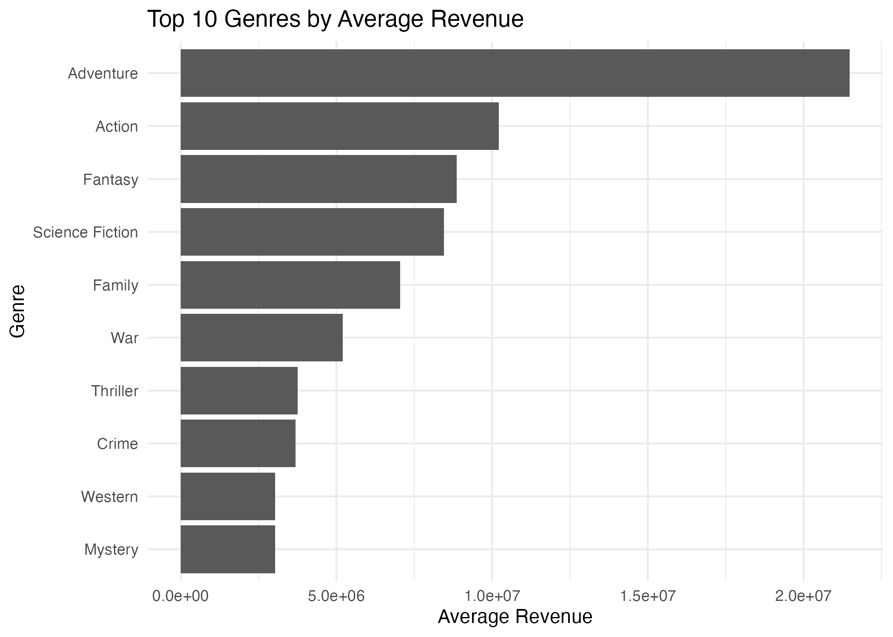
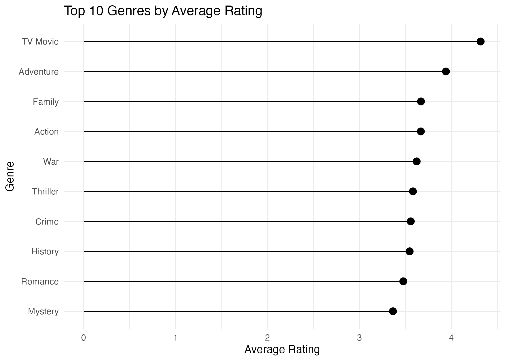
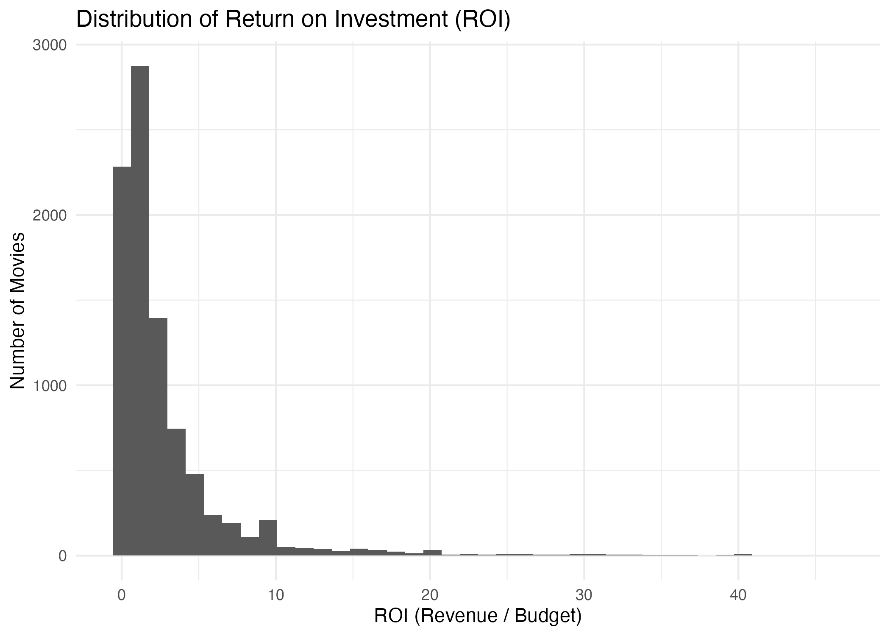
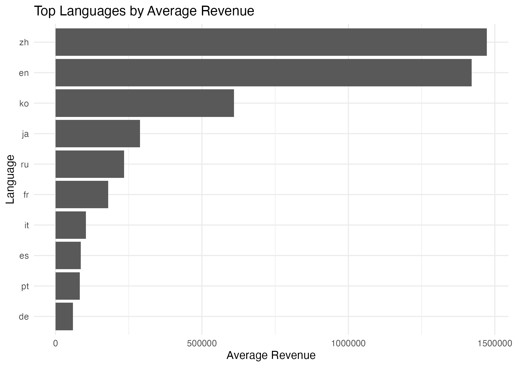
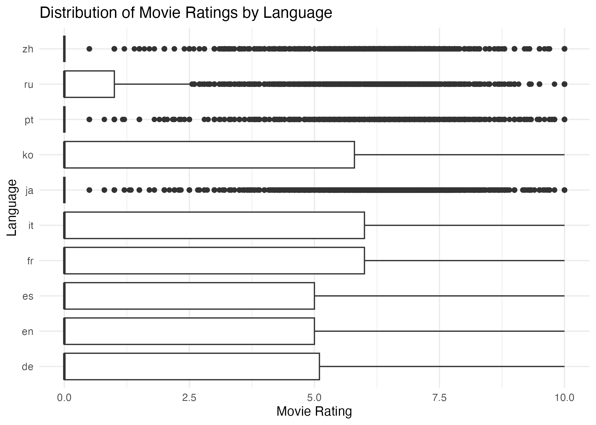

```{r setup, include=FALSE}
setwd("..")
library(ProjectTemplate)
load.project()
source("src/Analysis_function.R")
source("src/Cycle1_Analysis.R")
source("src/Cycle2_Analysis.R")
source("src/Summary_Analysis.R")
knitr::opts_chunk$set(echo = FALSE, warning = FALSE, message = FALSE)
```

# Introduction
## Context
The film industry contributes a significant amount of revenue globally through cinema sales and streaming platforms. The success of a film depends on multiple factors, which makes it important to identify and analyse the key factors to ensure the continuous profitability of the industry as well as the enhancement of the global economy. In this regard, the current report is concerned with analysing a movie dataset containing data regarding different success factors of movies from 2000 to 2024. The report has utilised the CRISP-DM framework to profoundly analyse data by breaking the process into 2 CRISP-DM cycles. CRISP-DM methodology involves a multi-steped iterative framework for the profound analysis of complex scenarios (Bemthuis et al., 2025). The first cycle has focused on understanding the film industry in terms of exploring the patterns of success, ratings, revenue growth and many more related aspects. The secondary cycle has focused on the in-depth analysis of the influence of genre and language on movie success.

## Research Objectives
First Cycle

To determine the success pattern of movies from 2000 to 2024 by exploring different factors associated with it

To comprehend the connection between a movie's budget and its revenue contribution

To identify the movies associated with high revenue and high ratings, and to comprehend the features most significant for movie success

Second Cycle

To examine the way movie genre impacts the ratings and the commercial success of movies

# First CRISP-DM Cycle
## Business Understanding
The continuously increasing production cost and budgetary constraints have made it difficult to maintain financial sustainability in the film industry (Singh & Asthana, 2025). In this regard, it has become necessary to explore the connection between budget and film success. This cycle involves understanding the business-related aspects of film production companies, emphasising the identification of the key success factors required to be focused on by film producers to ensure movie success. In order to gain this business understanding, the study has divided the main business question into sub-questions defined below.

### Stakeholder
This analysis is framed for a **streaming platform content-acquisition team**, responsible for deciding which types of films to license, promote, or commission. This stakeholder needs to understand which factors reliably predict commercial success (revenue) and critical/audience reception (rating), so that acquisition and production-partnership decisions can be prioritised accordingly.

### Success Criteria
The analysis will be considered successful if it identifies: (1) clear, consistent patterns in how budget, genre, and release timing relate to revenue and ratings; (2) whether high ratings reliably predict high revenue, or whether these are largely independent; and (3) actionable guidance, grounded in the data, that the stakeholder could use to prioritise future content decisions.

Research Questions

What are the key patterns of the success factors of movies in the dataset used?

How is the movie budget connected to the movie revenue in the film industry?

What type of changes have the movies experienced over time in terms of release, revenue and rating patterns?

Which movies have received the highest ratings and have generated the highest revenue?

## Data Understanding
The dataset consists of multiple CSV files with common columns such as id, title, genre, release date, budget, production country, production company, revenue and others. All the CSV files have been imported into the R platform and merged row-wise to form a single dataset containing data from all the files. These variables were retained because they map directly onto the stakeholder's core questions: budget, revenue and profit speak to commercial performance; vote_average and vote_count speak to critical and audience reception; and release_date, genres and original_language allow success to be tracked over time and broken down by content type, which is exactly the kind of pattern a content-acquisition team needs when deciding what to license or commission.

```{r data-understanding}
cat("Number of rows:", raw_row_count, "\n")
cat("Number of columns:", raw_col_count, "\n")
head(movies_raw)
```

The merged data consists of about `r format(raw_row_count, big.mark=",")` rows and `r raw_col_count` columns, indicating a huge dataset, making it effective to gain a clear understanding of the data pattern.

## Data Preparation
The column names have been converted to the data types required for data analysis. The duplicate columns have been removed to ensure the analysis generates accurate outcomes. The removal of the duplicate rows from the dataset has resulted in about 670072 rows in the cleaned dataset. Additional variables, such as profit, Return on Investment (ROI), and revenue success has been created. The rating groups have also been separated during data preparation to facilitate analysis, and only the movies from 2000 to 2024 have been filtered from the dataset. The row containing missing values has not been removed immediately, as that could decrease the entire dataset size significantly. The impossible run time and budget values have been removed from the dataset, making the dataset prepared for analysis.

```{r data-quality}
missing_summary
```

## Modeling
### Global Trends
The exploration of the basic summary of the prepared dataset shows that the 670072 movies between 2000 and 2024 are present in the dataset. The average rating, revenue, budget and run time are 2.050817, 894739.4, 351558.2 and 68.77461, respectively.

```{r basic-summary}
cat("\n===== BASIC SUMMARY =====\n")
cat("Total movies:", nrow(movies), "\n")
cat("Year range:", min(movies$release_year, na.rm = TRUE), "to", max(movies$release_year, na.rm = TRUE), "\n")
cat("Average rating:", mean(movies$vote_average, na.rm = TRUE), "\n")
cat("Average revenue:", mean(movies$revenue, na.rm = TRUE), "\n")
cat("Average budget:", mean(movies$budget, na.rm = TRUE), "\n")
cat("Average runtime:", mean(movies$runtime, na.rm = TRUE), "\n")
```

The top 10 movies in terms of revenue, release year, profit, budget and others have been explored in the form of tables first, and the exploratory plots have also been created to identify the patterns.

```{r summary-tables}
knitr::kable(top_revenue_movies, caption = "Top 10 Revenue Generating Movies")
knitr::kable(top_rated_movies, caption = "Top 10 Highest Rated Movies")
knitr::kable(movies_per_year, caption = "Count of Movies Per Year")
knitr::kable(avg_revenue_per_year, caption = "Average Revenue Per Year")
```

The first plot shows that the number of movies released per year has increased from the year 2000 onwards, with a slight decrease in 2020, which may be due to the pandemic situation. However, the movie count has been found to decrease significantly till 2024 despite recovering after 2020.

```{r plot-movies-per-year, out.width="70%"}
knitr::include_graphics("../graphs/01_movies_per_year.png")
```

The average rating has been found to consistently fall from 2000 onwards, indicating the gradual decrease in the quality of movies. This means the improvements in terms of developing stories and presentation of movies more relatable to audiences are required to achieve high ratings and movie success.

```{r rating-table}
knitr::kable(avg_rating_per_year, caption = "Average Ratings Per Year")
```

```{r plot-rating-per-year, out.width="70%"}
knitr::include_graphics("../graphs/02_rating_per_year.png")
```

```{r plot-rating-group, out.width="70%"}
knitr::include_graphics("../graphs/03_rating_group.png")
```

The low rated movies are greater in number compared to the moderate and high rated movies.

The average revenue per year has been found to fluctuate throughout from 2000 to 2024, indicating fluctuating audience satisfaction. In this case also, a significant decrease in revenue has been noticed during 2020, which then recovered; however, the pattern clearly indicates a tendency to decrease in revenue every year.

```{r plot-revenue-per-year, out.width="70%"}
knitr::include_graphics("../graphs/04_revenue_per_year.png")
```

The budget versus revenue plot shows that the budget has a strong positive connection with the revenue generated by a movie. It means investing in a movie to enhance its features results in a positive impact on the audience, leading to an increase in revenue generated by the movie. However, some exceptions are noticed in the plot, indicating that high-budget movies may not always result in the generation of high revenue.

```{r plot-budget-revenue, out.width="70%"}
knitr::include_graphics("../graphs/05_budget_vs_revenue.png")
```

The top 10 genres of movies have been explored in terms of the number of movies released in each genre. This shows that drama, documentary, and comedy are the top genres of movies among the existing ones. It means most of the stories in recent times are built on this genre, which may indicate that the current demand of the audience highly belongs to this genre. However, the connection between the top genres and the revenue or ratings needs to be explored further to comprehend the satisfaction of audiences with the genre.

```{r plot-runtime, out.width="70%"}
knitr::include_graphics("../graphs/06_runtime_distribution.png")
```

The run time of most of the movies has been found to be very less, indicating the movies are mostly filled with limited and specific content only.

```{r plot-top-genres, out.width="70%"}
knitr::include_graphics("../graphs/07_top_genres.png")
```

The matrix shows that revenue and profit share a significant positive connection, indicating that an increase in revenue results in increased profit, which is natural. Similarly, vote count has been found to be strongly positively related to revenue, budget and profit, indicating that more widely-watched movies tend to generate more revenue and profit; however, vote count reflects audience volume rather than audience approval, and vote_average (the actual rating) shows only a weak correlation with these factors. The popularity has been found to be slightly connected to the vote count and revenue of movies, which means the popular movies often generate more revenue as a huge audience visits to experience the movie. However, the connection is negligible, indicating that high ratings do not ensure high revenue.

```{r correlation, fig.width=5, fig.height=3}
knitr::kable(cor_matrix, caption = "Correlation Matrix")
corrplot::corrplot(cor_matrix, method = "color", type = "upper", tl.cex = 0.8)
```

## Evaluation - Cycle 1
### Key Findings

Increase in number of movies released per year.

Decrease in average ratings of movies per year.

Fluctuating average revenue per year with tendency to decrease consistently.

Budget strongly connected to revenue.

High ratings do not confirm high revenue.

### Link to Success Criteria

These findings speak directly to the success criteria set out in the Business Understanding: a clear pattern has been identified linking budget to revenue, while the connection between ratings and revenue is shown to be negligible - meaning ratings and revenue should be treated as largely independent signals of success rather than one predicting the other. This gives the stakeholder an early, data-grounded basis for acquisition decisions, while highlighting that further investigation (carried out in Cycle 2) is needed before more specific, actionable guidance can be given.

### Limitations
Negligible connection between different factors and movie success has been identified.

Presence of missing values in different columns that are included in the analysis process.

### Questions for Cycle 2
Which movie genre generates highest revenue and ratings?

Does genre and language have any special influence on movie success?

# Second CRISP-DM Cycle
## Refined Business Understanding
Based on the overall data analysis and findings received from the first CRISP-DM Cycle, it has been understood that most of the mentioned factors are interconnected to each other moderately. In this regard, the study intends to understand specifically, the connection between genre and revenue of movies in detail in the second CRISP-DM Cycle. This cycle also intends the way language influence the revenue of movies.

Research Questions

What is the best movie genre in the dataset based on the revenue and rating factors?

How does the movie language influence the success of movies?

## Enhanced Data Preparation
The data has been prepared for this section by selecting only the required columns from the dataset, such as revenue, genres, title, vote average, and id. The rows containing missing values in the genre columns have been removed from the dataset. The separate rows have been created based on separate genres to analyse the impact of individual genres on movie success. The columns have been created called average rating, average revenue and movie count, calculating their values from the dataset. The numerical columns have been sorted in decreasing order to identify the best genre.

## Advanced Modeling and Final Evaluation
### Influence of Genre on Movie Success

The exploration of the table comparing different genres in terms of revenue, ratings and others reveals that adventure is the best genre among the existing genres as it has contributed to the highest average revenue and average ratings. However, the highest movie count has been noticed in the drama genre, indicating that the emphasis on drama genre for movie development is one of the significant causes of deteriorating ratings and revenue from 2000 to 2024 in the film industry. Hence, the film producers need to emphasise creating adventure movies to gain high ratings, revenue and movie success.

```{r plot-genre-revenue, out.width="70%"}

```

The revenue and ratings may be considered the most important factors to estimate movie success, as high ratings by audiences can gradually attract more audiences to visit the hall to watch a movie. Revenue, being strongly connected to audience count, also depends on ratings, as the more the ratings the more the crowd of audience, indicating that ratings are the prime factor for movie success. Based on revenue, adventure is the genre generating highest revenue per year.

To go beyond revenue alone, the genres have also been ranked by average rating, and the overall spread of Return on Investment (ROI) across all movies has been examined, giving a fuller picture of genre performance and production efficiency.

```{r plot-genre-rating, out.width="70%"}

```

The distribution of Return on Investment shows that most movies cluster at low-to-moderate ROI, with a long tail of high-ROI outliers, indicating that a small number of movies generate disproportionately large returns relative to their budget.

```{r plot-roi-distribution, out.width="70%"}

```

### Influence of Language on Movie Success
```{r plot-language-revenue, out.width="70%"}

```

The analysis shows that the English language movies, despite generating high revenue and counts, possess limited ratings. On the other hand, the movies in other languages such as Chinese and other languages, despite having lower movie counts than English, have received competitive ratings. This indicates that the complete emphasis on the English language only by production companies may not be an appropriate decision to enhance movie success. It should be noted that this comparison is restricted to the 10 most common languages by movie count, so as to avoid unstable averages from languages with very few titles.

### Connection between language and ratings
```{r plot-language-ratings, out.width="70%"}

```

The Italian and French languages has been found to be at the top, indicating that audiences prefer these languages more than other languages.In this regard, developing movies in these languages can help gain huge audience count enhancing the chances of movie success.

## Evaluation - Cycle 2
### Key Findings

Adventure is the genre most strongly associated with both high average revenue and high average ratings.

Drama has the highest movie count but does not lead on revenue or rating, suggesting oversupply relative to audience reward.

English and Chinese language movies generate the highest revenue, but Italian and French language movies achieve the highest average ratings.

Revenue and ratings are not strongly linked - the highest-revenue movies are rarely the highest-rated ones.

### Link to Success Criteria
These findings directly satisfy the success criteria set out in the Business Understanding: a clear pattern has been identified (Adventure genre and non-English languages both associate with stronger audience reception), and the revenue-rating relationship has been clarified as largely independent rather than reliably predictive. This gives the stakeholder a concrete basis for content decisions: prioritising Adventure titles for revenue, while considering multilingual content investment to strengthen ratings.

### Limitations
Genre and language are both self-reported, categorical fields in the source data and may not capture nuanced audience segments.

The analysis does not control for confounding factors such as marketing spend or release timing, which likely also influence genre and language performance.

### Next Steps
Future work could model revenue and rating jointly (e.g. multivariate regression) to isolate the independent effect of genre and language while controlling for budget and release year.

A dedicated success label (rather than deriving it from revenue/rating thresholds) would allow more precise classification-based analysis in a future CRISP-DM cycle.

# Final Evaluation
## Major Findings

English and Chinese language movies have mostly generated high revenue.

Adventure genre movies has been found to generate significantly high revenue.

Italian and French language are top-rated languages among others.

Revenue and ratings are not directly connected to each other as the highest revenue movie and top-rated movies are different.

# Implications for Film Production Industry
Focus on generating movies on multiple languages can help film producers equally gain high ratings and revenue.

The adventure genre has been found to generate highest revenue indicating the film production industry can focus on this genre to enhance profitability.

Developing movies in Italian and French languages can enhances audience count, enhancing revenue.

The emphasis on multiple languages can help create movies in native languages of different people enhancing their understandability resulting in increased audience.

High ratings does not ensure high revenue, indicating that a high quality movie content is a priority along with top-rated language to ensure a successful movie.

# Study Limitations
The dataset consists of huge missing values in some of the columns which has been challenging to handle as the removal of those rows might have reduced the data size, imposing negative impact to the data analysis.

The findings of the study has been extracted from a single dataset.

The dataset lacks a separate column specifically designed to label movies as successful and failure. A small number of entries in the raw data (e.g. movies with several billion in reported revenue against a budget of only a few hundred dollars and zero votes) also appear to be data quality issues rather than genuine box-office performance, and should be interpreted with caution where they influence top-revenue rankings.

# Conclusions
Based on the overall analysis in the CRISP-DM Cycles, it can be inferred that the emphasis on creating more movies in the adventure genre is necessary for enhanced profitability and revenue increase in the film industry. The ratings are the most important factor influencing the success of a movie by spreading positive vibes and attracting new audiences to watch the movie. The development of movies with top-rated languages such as Italian, French and others can influence movies success. The film industry can rely on this information to enhance its growth and revenue in future.

# Methodological Notes

The CRISP-DM methodological approach has been executed with two iterative cycles.

The first cycle has focused on exploring global trends.

The second cycle has focused on specific details regarding the connection of movie success with genre, language, and ratings.

The R programming language has been used to execute the entire coding part.

Histogram, bar plots and others have been used to analyse the dataset. All exploratory and modelling visualisations in this report were produced using ggplot2, with a single exception: the correlation matrix visualisation uses the corrplot package, as it produces a purpose-built, directly interpretable colour-coded correlation grid that ggplot2 does not offer natively without substantial additional code.

# References
Bemthuis, R. H., Govers, R. R., & Asadi, A. (2025). A CRISP-DM-based methodology for assessing agent-based simulation models using process mining [Review of A CRISP-DM-based methodology for assessing agent-based simulation models using process mining]. Journal of Simulation, 1-22. https://doi.org/10.1080/17477778.2025.2508245

Singh, P., & Asthana, S. (2025). Financial Sustainability in the Film Industry: Challenges, Strategies, and Future Directions. International Journal on Science and Technology (IJSAT) IJSAT25033691, 16(3). https://www.ijsat.org/papers/2025/3/3691.pdf
